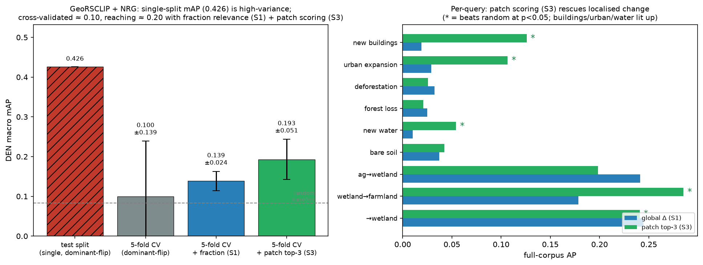
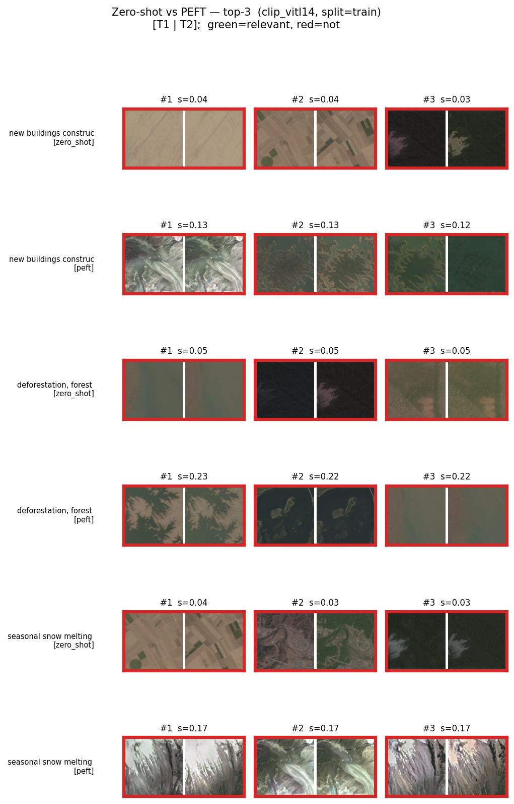
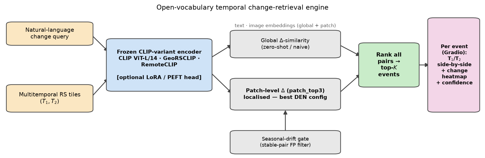
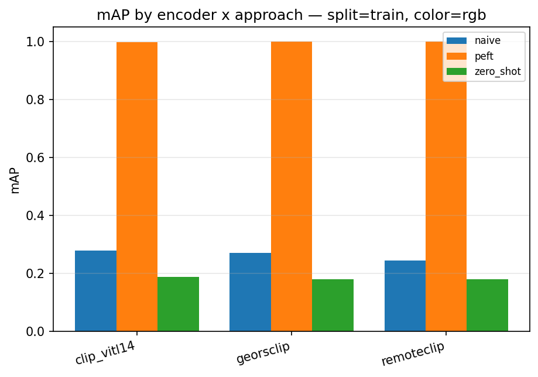
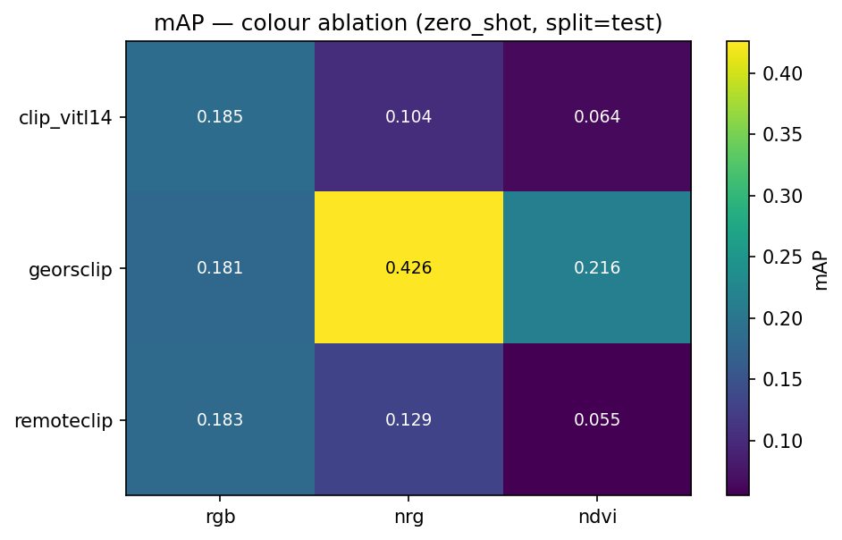
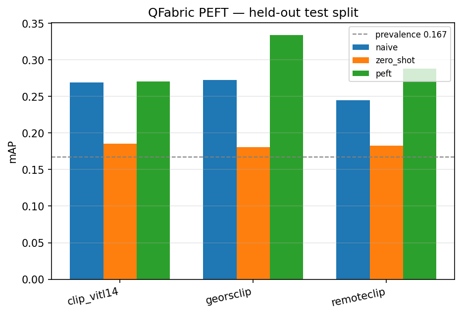
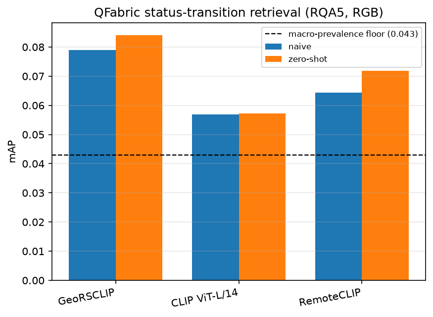
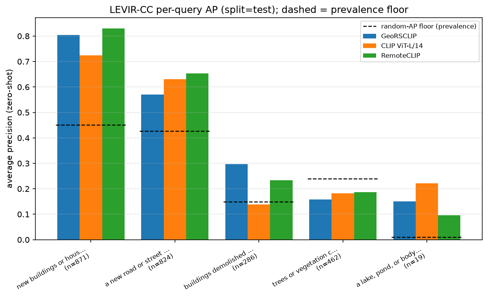
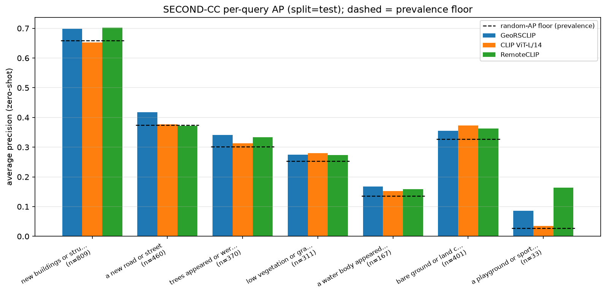
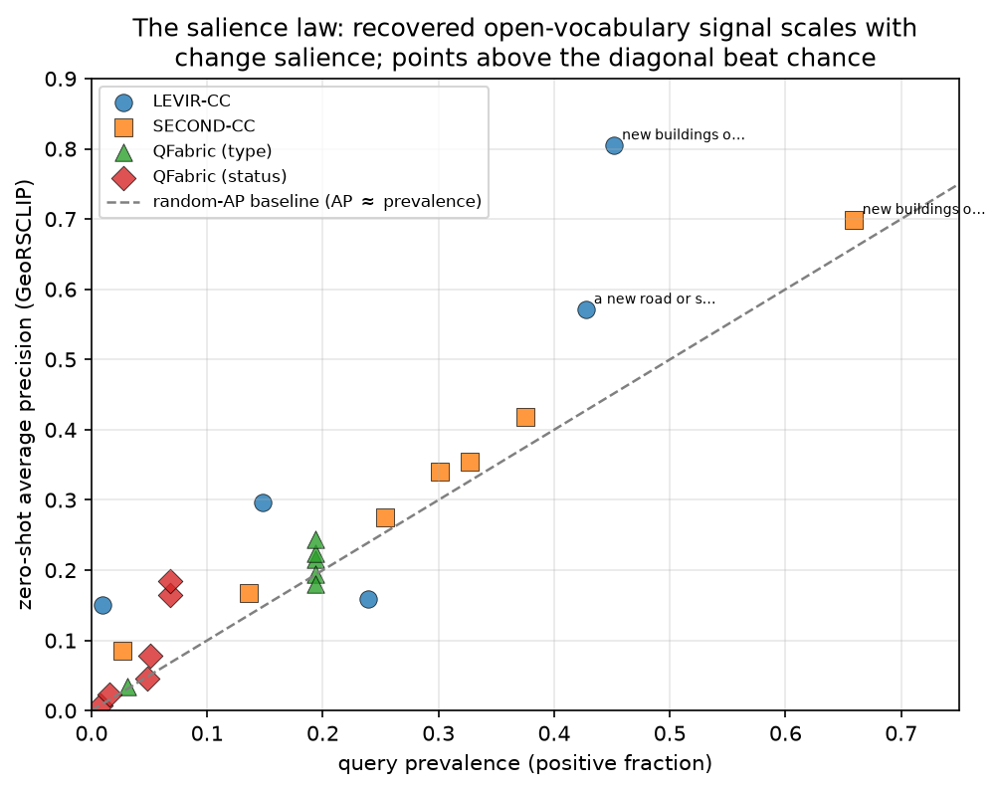

# Open Vocabulary Temporal Change Retrieval (GBDA Lab Project)

> **Canonical results → the [Technical report](#technical-report) below** (best: GeoRSCLIP+NRG `patch_top3`, CV mAP 0.193 ± 0.051, 4/9 FDR-significant).

A *Semantic Change Search Engine*: given a natural-language query
(e.g. *"new buildings on former agricultural land"*, *"forest cleared to bare
soil"*), retrieve the satellite image **pairs and the timestep** where that
change occurred — across a multitemporal dataset, without training a
class-specific detector.

Frozen vision-language backbones (CLIP / GeoRSCLIP / RemoteCLIP) encode each
timestep; a bi-temporal *change feature* is matched against the query text.
Primary dataset: **Dynamic EarthNet (DEN)**; the dataset-agnostic registry also
runs **QFabric** (construction change-types), **LEVIR-CC/MCI** (human-captioned
building/road change + masks) and **SECOND-CC** (a six-class land-cover open
vocabulary + semantic masks), with LEVIR-MCI and SECOND-CC masks driving
quantitative change localisation.

> **Just want to run the app?** Jump to [Run / install / use](#run--install--use) —
> install, then a 30-second synthetic demo or the real dataset.

## Demo


*Enter a free-text change query, pick a dataset / encoder / scoring approach, and get
ranked before→after pairs with a change heatmap on T2.* To (re)generate the screenshot
locally (it lands in `report/figures/app_screenshot.png`):

```bash
pip install -e .
python -m scripts.make_den_fixture
python -m src.app --root tests/fixtures/den_tiny --split all --encoder clip_vitl14   # http://127.0.0.1:7860
# then save a screenshot of the browser tab to report/figures/app_screenshot.png
```

## Pipeline

End-to-end flow for one user query, with the module responsible at each
step:

```
┌─ offline (one-time per dataset+encoder, cached) ─────────────────────────┐
│                                                                          │
│  TemporalDataset.list_pairs()                src/datasets/*               │
│           │                                                               │
│           ▼                                                               │
│  load_pair_images(pair)  ──▶  PIL T1, T2                                  │
│           │                                                               │
│           ▼                                                               │
│  ImageTextEncoder.encode_image     src/encoders/*  (CLIP / GeoRS /        │
│           │                                          RemoteCLIP, frozen)  │
│           ▼                                                               │
│  f_T1, f_T2  (L2-normed, [N, D])  ──cache──▶                              │
│   data/cache/<dataset>__<encoder>__<split>[_<color>][_lora]__pair_embeddings.npz │
│                                       src/embeddings.py                   │
└──────────────────────────────────────────────────────────────────────────┘

┌─ adapter training (only for `peft` approach; offline) ───────────────────┐
│                                                                          │
│  weak caption per pair  ──ProjectionHead──▶  masked symm. InfoNCE         │
│  (e.g. "agriculture replaced by impervious surface")                     │
│                                              src/train.py                 │
│  → models/<dataset>__<encoder>__adapter.pt                                │
└──────────────────────────────────────────────────────────────────────────┘

┌─ inference (per query, hot path) ────────────────────────────────────────┐
│                                                                          │
│  user query text  ─encoder.encode_text─▶  t  (same shared [D] space)     │
│                                                                          │
│       ┌───────────────── ChangeRetriever.score_all ──────────────────┐    │
│       │   naive      :  t · f_T2                                     │    │
│       │   zero_shot  :  t · f_T2  −  t · f_T1   (Δ-similarity)       │    │
│       │   peft       :  t · g(Δf)   with Δf = f_T2 − f_T1            │    │
│       └────────────────────────────────────────────────────────────┘    │
│                              src/retrieval.py                            │
│                                    │                                     │
│                                    ▼                                     │
│  rank all pairs by score  ──▶  top-K change events                       │
│                                    │                                     │
│                                    ▼                                     │
│  for top-1: dataset.load_pair_images(pair)  +                            │
│  encoder.compute_patch_text_similarity → heatmap on T2                   │
│                                              src/app.py + src/heatmap.py │
│                                                                          │
│  label-grounded benchmark (offline, optional)                            │
│  per-query relevance from PairLabel → Recall@K, mAP, seasonal drift      │
│                                              src/benchmark.py            │
└──────────────────────────────────────────────────────────────────────────┘
```

Three scoring **approaches** (the supervisor-requested comparison):

| Approach    | Score                                       | Training |
|-------------|---------------------------------------------|----------|
| `naive`     | cos(t, f_T2)                                | none (lower bound) |
| `zero_shot` | cos(t, f_T2) − cos(t, f_T1)  (Δ-similarity) | none |
| `peft`      | cos(t, g(Δf)), g = trained ProjectionHead   | ~0.5–0.7 M params (adapter only; backbones frozen) |

*Per-encoder results for all three approaches — in-distribution and cross-split — are in the [Technical report](#technical-report) below (§8.2).*

**Key decoupling:** `f_T1, f_T2` are cached per `(dataset, encoder, split, color_mode)` so all
three approaches and any number of queries reuse the same one-time encode
pass. Adding a dataset = implementing the `TemporalDataset` protocol +
registering — the entire flow above re-uses the new dataset unchanged
(see [Extending](#extending) below).

**Evaluation** is label-grounded: a fixed query set (per dataset, under
`src/queries/<name>.py`) maps each query to a relevance rule over the
derived `PairLabel`s → Recall@K, mAP, plus a seasonal-vs-permanent
("semantic drift") error report.

## Results at a glance

Everything below is audited (random-ranking baselines, permutation tests, BH-FDR,
leakage-free 5-fold leave-AOI-out cross-validation); full tables and the audit trail are in the
[Technical report](#technical-report) below; the formal written report is [`report/main.tex`](report/main.tex) (compiled to PDF).

| Finding | Number |
|---|---|
| Best configuration: GeoRSCLIP + NRG, patch-level top-3 Δ-scoring | **CV mAP 0.193 ± 0.051**, 4/9 queries FDR-significant (buildings, urban, wetland transitions) |
| Global zero-shot Δ-similarity (same encoder, fraction relevance) | CV mAP 0.139 ± 0.024 (2/9) |
| The often-quoted single-split 0.426 | a lucky 110-pair fold — CV says 0.100 ± 0.139; never a headline |
| PEFT / LoRA adapters | memorise training AOIs (train mAP 0.42–0.998); no held-out gain over zero-shot |
| Seasonal false-positive gate | stable-pair FPR → 0 at threshold ≥ 0.05 |
| LEVIR-CC (5 open-vocab queries, human captions) | salient construction strong (buildings AP ≈ 0.8, roads ≈ 0.6); subtle/sparse weak (demolition, vegetation, water ≈ 0.15–0.30); 5-query macro ≈ 0.40 |
| SECOND-CC (7 change types, human captions + semantic masks) | open-vocab breadth: every type clears its prevalence floor but modestly — buildings ≈ 0.70, road/ground/trees ≈ 0.34–0.42, water 0.17; zero-shot macro ≈ 0.33 vs floor 0.30; localization weak (lifts ±0.04) |
| Change localization (LEVIR-MCI + SECOND-CC masks) | heatmap is a weak localizer — pointing-game lift within ±0.04–0.10 of the random-patch floor; only road on RS-pretrained encoders is clearly positive |
| Frozen-VLM ceiling on DEN | ≈ 0.20 CV mAP — robust across hybrids, prompt ensembles, attention variants, query-gated routing |



*The honest arc: single-split 0.426 collapses under cross-validation to ≈0.10; fixing the
relevance rule and scoring locally (patch top-3) recovers 0.193 ± 0.051.*



*Zero-shot vs PEFT visual comparison (CLIP ViT-L/14, train split): the adapter's
in-distribution wins are memorisation; held-out, frozen zero-shot is the stronger ranking.*

## Module map

| File | Role |
|------|------|
| `src/datasets/` | `TemporalDataset` protocol, `DENDataset` (raster), `DENNpyDataset` (DynNet `.npy` + `color_mode` rgb/nrg/ndvi via NIR infrared frames), `TEOChatlasQFabricDataset` (`qfabric_teo` — QFabric crops + RQA2 change-type labels), `StatusQFabricDataset` (`qfabric_status` — RQA5 status transitions), `LevirCCDataset` (`levir_cc` — building-change pairs + human captions), `LevirMCIDataset` (`levir_mci` — LEVIR-CC + building/road change masks), `SecondCCDataset` (`second_cc` — captioned six-class land-cover change + per-phase semantic masks), layout-detecting registry + opts adapters |
| `src/queries/` | Per-dataset query sets (`den.py`, `qfabric.py`, `qfabric_status.py`, `levir_cc.py`, `levir_mci.py`, `second_cc.py`); registry resolved by `dataset.name` |
| `src/results_io.py` | serialize `BenchmarkReport` to JSON/CSV (torch-free); consumed by the figure scripts |
| `src/error_analysis.py` | per-query confusion matrix + precision/recall (seasonal-vs-permanent error analysis) |
| `src/encoders/` | `ImageTextEncoder` protocol; `clip_vitl14` (768-d), `georsclip` (512-d), `remoteclip` (768-d) |
| `src/text_encoder.py` | frozen CLIP text tower (`text_model` + `text_projection`, device-aware) |
| `src/features.py` | `compute_change_feature` (difference / concatenate) |
| `src/embeddings.py` | per-pair `f_T1,f_T2` compute + npz cache (`PairEmbeddingStore`); `cache_tag` arg keys cache by split+color to prevent cross-split collision |
| `src/retrieval.py` | `ChangeRetriever` — naive / zero_shot / peft scoring |
| `src/benchmark.py` | query set + label relevance, Recall@K / mAP / drift |
| `src/model.py` | `ProjectionHead` adapter, InfoNCE, adapter save/load |
| `src/train.py` | PEFT training (masked symmetric InfoNCE on weak captions) |
| `src/lora_train.py` | LoRA fine-tuning of visual encoder via peft; `train_lora`, `merge_lora_into_encoder`, `save_lora` |
| `src/geo_filter.py` | `GeoFilter` — filter pairs by continental region or lat/lon bbox using `aoi_metadata.json`; toggleable |
| `src/rerank.py` | `Reranker` — post-retrieval re-ranking: `diversity` (unique AOIs) or `coherence` (cluster near top-1); toggleable |
| `src/app.py` | Gradio engine + UI (Dataset / Encoder / Approach selectors) |
| `app.py` | HuggingFace Spaces entry point (uses tiny fixture by default; override via env vars) |
| `scripts/download_den.py` | fetch + extract DEN subset, build label index |
| `scripts/build_qfabric_labels.py` | TEOChatlas RQA2 → `qfabric_teo_labels.json` (27,879 real crop→change-type labels) |
| `scripts/build_qfabric_status_labels.py` | TEOChatlas RQA5 → `qfabric_status_labels.json` (per-timepoint construction-status labels) |
| `scripts/eval_rerank.py` | re-ranking benchmark (diversity / coherence) on the DEN test split (report Appendix B) |
| `scripts/make_cv_figure.py` | CV-progression figure (single-split → full-corpus → 5-fold) from `results/` (report §8.1) |
| `scripts/run_seasonal_gate.py` | seasonal false-positive gate / stable-pair FPR robustness check |
| `scripts/benchmark_qfabric.py` | extract QFabric crops + encode + label-grounded change-type mAP (`qfabric_teo`) |
| `scripts/benchmark_levir_cc.py` | LEVIR-CC 5-query open-vocab retrieval, per-query AP (reads the shared LEVIR-MCI dir) |
| `scripts/benchmark_second_cc.py` | SECOND-CC 7-query open-vocab breadth retrieval, per-query AP |
| `scripts/eval_localization.py` | quantitative change localisation (pointing-game + patch-AP vs mask) — `--dataset levir_mci\|second_cc` |
| `scripts/peft_augment_eval.py` | Track-4 anti-memorization check: frozen / PEFT / PEFT+feature-noise on the same leakage-free folds |
| `scripts/make_den_fixture.py` | tiny synthetic DEN tree for fast tests |
| `scripts/run_pipeline.py` | one-command run with `--train-split` / `--eval-splits` / `--color-mode` / `--mode` / `--lora` / `--results-dir`; cross-split mAP table |
| `scripts/precompute_patch_embeddings.py` | warm the on-disk per-patch embedding cache (`PatchEmbeddingStore` in `src/embeddings.py`) so the first `approach="patch"` query in the app is instant instead of a full GPU pass |
| `scripts/export_results.py` | regenerate benchmarks from cache → `results/*.json` + `macro_summary.csv` (`--confusion` for error analysis) |
| `scripts/make_figures.py` | publication PNGs (recall curves, mAP bars, colour heatmap, seasonal drift, cross-split, confusion) from `results/` |
| `scripts/make_comparison_figure.py` | static zero-shot-vs-PEFT top-K visual comparison per encoder |
| `scripts/lora_sweep.py` | LoRA rank/epoch sweep (georsclip+nrg), in-memory, no cache/model clobber |
| `scripts/significance_audit.py` | random-ranking baseline + permutation p + BH-FDR over every result cell → `results/results_audit_summary.csv` (report §7 protocol, applied across §8) |
| `scripts/cv_eval.py` | full-corpus + k-fold AOI cross-validation with bootstrap CIs; `--relevance fraction` swaps dominant-class-flip relevance for pixel-fraction (report §8.1); merges cached split embeddings, no re-encode |
| `scripts/patch_eval.py` | patch-level (localised) Δ-similarity change retrieval vs the global baseline (report §8.1, "S3"); caches per-patch embeddings via `encoder.encode_image_patches`. `--approach hybrid` fuses global+patch, `patch_softattn`/`patch_spatial` are training-free change-attention variants, `--prompt-ensemble` averages query templates (all report §8.3) |
| `.github/workflows/` | CI: `gitleaks.yml` secret-scanning on push/PR |

## Run / install / use

**Requirements:** Python 3.12+ · ~3 GB disk (model weights) · ~9 GB more for real DEN · GPU optional.
RS-encoder weights download from HuggingFace on first use into `.model_cache/`. On-disk DEN
layouts (`planet/*.tif` raster or DynNet preprocessed `.npy`) are auto-detected; dataset sources
in [Datasets & model resources](#datasets--model-resources) below.

### 1. Setup (one-time)

```bash
git clone <repo-url> && cd MSc_GBDA-OV_Temporal_Change_Retrieval

python -m venv .venv
source .venv/bin/activate          # Windows (PowerShell): .venv\Scripts\Activate.ps1
                                   #   if blocked once: Set-ExecutionPolicy -Scope CurrentUser RemoteSigned

pip install -e .
```

### 2. Option A — 30-second synthetic demo (no download)

```bash
python -m scripts.make_den_fixture
# Builds tests/fixtures/den_tiny/: 2 AOIs × 8 months, <1 MB, deterministic.

python -m src.app --root tests/fixtures/den_tiny --split all --encoder clip_vitl14
# First run downloads CLIP weights (~1.6 GB) into .model_cache/ — one-time.
# Open http://127.0.0.1:7860
```

### 2. Option B — real Dynamic EarthNet (~7 GB)

```bash
python -m scripts.download_den --dest data/DynamicEarthNet
# ~7 GB ZIP via gdown; extracted; idempotent (_done.marker guards re-runs).

python -m src.app --dataset dynamic_earthnet --root data/DynamicEarthNet --encoder clip_vitl14
# DEN's launch profile supplies split/colour; --approach defaults to zero_shot.
# Switch to --approach peft (or patch) in the UI for the other scorings.
```

### App usage

Enter a query, press **Search**. Example queries: `agricultural land converted to wetland` ·
`new buildings on former farmland` · `forest cleared to bare soil`. Results: T1 / T2 tiles side
by side · heatmap on T2 · confidence (0–1) · permanence note (`permanent` / `likely SEASONAL` /
`stable`) · ranked table. Two control accordions: **Settings** (Dataset / Encoder / Approach —
naive / zero-shot / **patch** (localised, best on DEN) / PEFT — / Color Mode / LoRA — needs
**Apply** to rebuild embeddings) and **Filters & Re-ranking**
(geographic filter, re-ranking — next **Search**, no Apply). Startup defaults via CLI flags:

| Flag | Default | Notes |
|---|---|---|
| `--dataset` | `levir_mci` | Corpus to load (must have a query set + launch profile). |
| `--encoder` | `georsclip` | `clip_vitl14` / `georsclip` / `remoteclip`. |
| `--approach` | `zero_shot` | `naive` / `zero_shot` / `patch` / `peft` (switchable in the UI). |
| `--root` | dataset profile | Dataset dir; defaults to the selected dataset's launch-profile root. |
| `--split` | dataset profile | `train`/`val`/`test`/`all`; defaults to the dataset's profile split. |
| `--color-mode` | dataset profile | `rgb`/`nrg`/`ndvi`; DEN profile defaults to `nrg`, other corpora to `rgb`. |
| `--pairing` | `bimonthly` | How DEN's 24 monthly timesteps pair into (T1, T2). |
| `--host` | `127.0.0.1` | Bind address; `0.0.0.0` exposes on the LAN (auto-selected on a HF Space). |
| `--port` | `7860` | Gradio HTTP port (in use? add `--port 7861`). |
| `--lora` / `--no-lora` | off | Load LoRA-adapted embeddings (pre-cache via `run_pipeline --lora`). |
| `--geo-filter` / `--no-geo-filter` | off | Geographic region filter. |
| `--rerank` / `--no-rerank` | off | Post-retrieval re-ranking. |
| `--rerank-strategy` | `diversity` | `diversity` = unique locations; `coherence` = cluster near top-1. |

> `peft` errors "no adapter" → adapter missing from `models/`; train with `run_pipeline` (below)
> or switch to `zero_shot`. **Hosted demo (no install):** push the repo to a HuggingFace Space —
> `app.py` + `requirements.txt` are ready.

### Developer — pipeline, training, tests

```bash
# Full pipeline: train on train split, evaluate on all three splits
python -m scripts.run_pipeline --root data/DynamicEarthNet \
    --encoder clip_vitl14 --train-split train --eval-splits train val test --epochs 40

# Best zero-shot generalisation (GeoRSCLIP + NIR, no training)
python -m scripts.run_pipeline --root data/DynamicEarthNet \
    --encoder georsclip --color-mode nrg --eval-splits train val test --skip-train

# LoRA adapter on the visual encoder
python -m scripts.run_pipeline --root data/DynamicEarthNet \
    --encoder georsclip --color-mode nrg --skip-train \
    --lora --lora-epochs 20 --lora-rank 4 --lora-alpha 8 --eval-splits train val test
```

Repeat with `--encoder georsclip` / `remoteclip` for the three-encoder comparison in the
[Technical report](#technical-report) below (§8.2). `run_pipeline` is the canonical, cache-consistent flow; the
individual stages (`src.embeddings`, `src.benchmark`, `src.train`, `src.lora_train`) are
convenience entry points — pass the same `--split` / `--color-mode` to every stage so they
share the split-tagged embedding cache.

```bash
pytest -q                              # full suite: 250 tests, 1 skipped (real-CLIP test_text_encoder needs weights)
pytest -q --ignore=tests/test_text_encoder.py   # fast CPU loop: 234 tests, ~65 s (mock encoders, synthetic fixture)
```

## Dependencies — `pyproject.toml` vs `requirements.txt`

Two dependency files, two purposes:

- **`pyproject.toml`** — the full development install (`pip install -e .`). It is the source of
  truth for local work: the runtime stack **plus** the test/figure/data extras the app itself
  never imports (`pytest`, `coverage`, `matplotlib` for the report figures, `gdown` for dataset
  download) and `opencv-python`. `pip` ignores the `[tool.uv.sources]` CUDA index, so a bare
  editable install pulls CPU Torch — install the matching CUDA wheel afterwards if you want GPU.
- **`requirements.txt`** — the lightweight **HuggingFace Space** deployment subset: just the
  runtime the `app.py` import path needs. It drops the test/figure/data extras and uses
  `opencv-python-headless` (no display libs) to keep the Space image small.

Keep the runtime packages consistent between the two; only the test/figure/data extras and the
`opencv-python` → `opencv-python-headless` swap should differ.

## Extending

The pipeline is **dataset-agnostic**. Every shared file (`embeddings.py`, `retrieval.py`,
`benchmark.py`, `train.py`, `app.py`, `scripts/run_pipeline.py`) consumes only the
`TemporalDataset` protocol and the dataset/encoder/query registries. Concrete loaders and
dataset-specific choices live in their own modules and self-register.

**Hard rule: adding a dataset = adding files only, never editing shared pipeline files.**

### Plug-in points

| Concern | Where | How |
|---|---|---|
| Dataset loader | `src/datasets/<name>.py` | Implement the `TemporalDataset` protocol (see `src/datasets/base.py`) |
| Loader registration | same file | `register_dataset(name, factory, opts_adapter)` from `src/datasets/registry.py`; add a line to `registry.py` only for a new built-in — third-party datasets can register from their own module on import |
| Generic-options mapping | same opts adapter | Maps `(root, pairing, split, **extra)` → loader kwargs; `color_mode` travels via `**extra` to `DENNpyDataset` |
| Encoder | `src/encoders/<name>.py` | Implement `ImageTextEncoder`; `register_encoder(...)` in `src/encoders/__init__.py` |
| Benchmark query set | `src/queries/<name>.py` | List of `Query(text, category, predicate)`; `register_queries(name, queries)`; auto-imported by `src/queries/__init__.py` |
| App / CLI | nothing — dropdown and `--dataset` / `--encoder` choices derive from the registries |

### What a new dataset adds (and only adds)

```
src/datasets/<name>.py          # loader, register_dataset(...)
src/queries/<name>.py           # query set, register_queries(...)
src/queries/__init__.py         # ONE import line: from . import <name>
tests/test_<name>.py            # loader-level tests
```

If you find yourself editing `embeddings.py`, `retrieval.py`, `benchmark.py`, `train.py`,
`app.py`, or `scripts/run_pipeline.py` for a new dataset, stop — an existing extension point
already covers it.

### Cache & artefact paths

- **Embeddings:** `data/cache/<dataset>__<encoder>[__<tag>]__pair_embeddings.npz`, where `<tag>` =
  `{split}[_{color_mode}][_lora]` — built by `cache_tag_for()`. Pass `cache_tag` to
  `load_or_compute()` to isolate caches per split / colour / LoRA.
- **Adapters:** `models/<dataset>__<encoder>[__<color>][__<split>][__<mode>]__adapter.pt` — the
  committed `train` split + `difference` mode take no suffix; others append `_<split>` / `_<mode>`.
- Keyed by `(dataset, encoder, split, color_mode)` — no cross-split/colour collision; a stale
  pair-set on load triggers automatic recompute and overwrites the cache at the same path.

### Shared helpers (not plug-in points)

- `src/stats.py::rand_ap(...)` — the shuffle-based random-AP baseline used by the significance
  scripts. `scripts/cv_eval.py` keeps its own `rng.permutation` variant on purpose, to preserve its
  committed RNG-dependent results.
- `src/embeddings.py::cache_tag_for(split, color_mode, lora)` — single source of truth for
  split/colour/LoRA cache tags; import it rather than re-deriving.

## Datasets & model resources

Download links and citations for the datasets and encoders used.

### Datasets

- **Dynamic EarthNet** (primary; CVPR 2022, Toker et al.) — daily multi-spectral Planet imagery,
  75 AOIs, monthly 7-class LULC labels. [Paper](https://arxiv.org/abs/2203.12560) ·
  [dynnet repo](https://github.com/aysim/dynnet) · preprocessed ~7 GB via
  `gdown 1cMP57SPQWYKMy8X60iK217C28RFBkd2z` (wrapped by `scripts/download_den.py`) ·
  [torchgeo HF](https://huggingface.co/datasets/torchgeo/dynamic_earthnet) ·
  [HEVC-compressed HF](https://huggingface.co/datasets/tacofoundation/DynamicEarthNet-video) ·
  raw ~525 GB [TUM Mediatum](https://mediatum.ub.tum.de/1650201).
- **QFabric** (CVPR EarthVision 2021, Verma et al.) — used here in the reduced 2-date TEOChatlas
  form (`qfabric_teo`): [TEOChatlas](https://huggingface.co/datasets/jirvin16/TEOChatlas). The full
  5-date + COCO-polygon-mask form ([labaerien/qfabric](https://huggingface.co/datasets/labaerien/qfabric),
  **gated**) is access-blocked and out of scope — see the report's §11.
  [Paper](https://openaccess.thecvf.com/content/CVPR2021W/EarthVision/papers/Verma_QFabric_Multi-Task_Change_Detection_Dataset_CVPRW_2021_paper.pdf).
  (Avoid `EVER-Z/QFabric_mt_images_1024` — 298 GB, image-only, no masks.)
- **LEVIR-CC / LEVIR-MCI** — building/road change captions + pixel masks (in-repo loaders
  `levir_cc` / `levir_mci`).
- **SECOND-CC** — six-class land-cover change + semantic maps
  ([Zenodo 10.5281/zenodo.16937571](https://doi.org/10.5281/zenodo.16937571); `second_cc`).
- **fMoW** (CVPR 2018) — assessed and **rejected** (functional classification, no change labels;
  see the report's §11). [Paper](https://arxiv.org/abs/1711.07846).

### Encoders

- **CLIP ViT-L/14** (OpenAI, Radford et al. 2021) — general backbone.
  [Paper](https://arxiv.org/abs/2103.00020) · [HF](https://huggingface.co/openai/clip-vit-large-patch14).
- **GeoRSCLIP** (RS5M, Om AI Lab) — RS-pretrained, the headline encoder.
  [Paper](https://arxiv.org/abs/2306.11300) · [HF](https://huggingface.co/Zilun/GeoRSCLIP).
- **RemoteCLIP** (IEEE TGRS) — RS-pretrained.
  [Paper](https://arxiv.org/abs/2306.11029) · [repo](https://github.com/ChenDelong1999/RemoteCLIP).
- All loaded via [OpenCLIP](https://github.com/mlfoundations/open_clip); weights auto-download from
  HuggingFace on first use into `.model_cache/`.

---

## Technical report

*Full report in markdown, kept in sync with `report/main.tex` (the compiled PDF is the formal deliverable — update both together).*

**GBDA Case 11 — National Technical University of Athens, School of Electrical and Computer Engineering, IPPS Data Science and Machine Learning, Geospatial Big Data Analytics.** Supervisor: Vasilis Tsironis.

### Abstract

We build a semantic change search engine that, given a free-text query (e.g. "agricultural land converted to wetland"), ranks bi-temporal satellite image pairs by how well the change between the two timesteps matches the query, and returns the matched tiles, the timestep, a localisation heatmap, a confidence, and a seasonal-vs-permanent flag. The system uses frozen CLIP-variant vision-language backbones and compares three scoring approaches — a naive image baseline, a zero-shot Δ-similarity, and a parameter-efficient fine-tuned (PEFT) adapter — across three encoders on Dynamic EarthNet (DEN), with three further datasets (QFabric, LEVIR-CC/MCI, and SECOND-CC) validating the dataset-agnostic design and extending it to open-vocabulary breadth and pixel-level change localisation. All findings are reported under a strict statistical protocol (random-ranking baselines, FDR correction, and leave-one-AOI-out cross-validation). Out of distribution, the frozen zero-shot score beats the learned PEFT and LoRA adapters: the adapters' high in-distribution scores (0.420–0.998 mAP) measure the adapter evaluated on its own training pairs (memorisation) and collapse to or below chance on held-out areas. Single-split test mAP on the 110-pair split is high-variance — the GeoRSCLIP+NRG configuration reaches 0.426 on one split, while its 5-fold AOI cross-validated estimate is 0.100 ± 0.139. Defining retrieval relevance by the per-class pixel-fraction change the labels already encode, and scoring change locally with a patch-level Δ-score, raises cross-validated mAP to 0.193 ± 0.051 and makes localised change-types — new buildings and urban expansion, with new water borderline — retrievable above chance. On LEVIR-CC the same frozen engine retrieves salient building and road change strongly (per-query AP ≈ 0.6–0.8) but subtle vegetation and sparse water change only near their prevalence floors, so the open-vocabulary signal scales sharply with change salience. SECOND-CC extends this to a seven-class open vocabulary — every change type clears its prevalence floor but only modestly (zero-shot macro ≈ 0.33 vs a ≈ 0.30 floor). Using the LEVIR-MCI and SECOND-CC pixel masks we also score the change heatmap quantitatively: it is a weak localiser (pointing-game lift within ±0.04–0.10 of a random-patch floor), so localising change is harder than retrieving it. The recurring lesson is that spectral physics and spatial locality carry the signal, while global embeddings and learned visual priors dilute or memorise it, and that small single-split scores require cross-validation before they estimate generalisation.

### 1. Introduction and objectives

Traditional change detection is limited to a few predefined categories (e.g. "urban growth" or "forest loss"). This project moves toward open-vocabulary change retrieval by leveraging Vision-Language Models (VLMs): instead of training a class-specific detector, we build a system that identifies semantically defined transitions from natural-language queries (e.g. "new industrial buildings appearing on former agricultural land") and searches across a multitemporal dataset to find the tiles and time-steps where the described change occurred. Text and image-change embeddings are aligned, and a pair is scored by the cosine similarity between its change embedding and the query embedding.

Per the GBDA Case 11 brief, the work is constrained to a low-compute budget and must deliver a subset of an appropriate dataset, CLIP-variant frozen encoders, both zero-shot inference and light PEFT, retrieval metrics (Recall@K, mAP), an error analysis of seasonal-vs-permanent confusion ("semantic drift"), and a Gradio Semantic Change Search Engine as the product deliverable. The primary dataset is Dynamic EarthNet (DEN), which provides daily multi-spectral Planet Fusion data ideal for pinpointing the exact time-step of change; the dataset-agnostic design is exercised on QFabric, LEVIR-CC/MCI, and SECOND-CC.

This report makes three contributions. First, it delivers a working, dataset-agnostic open-vocabulary change-retrieval engine with a Gradio interface and a label-grounded Recall@K/mAP benchmark. Second, it reports a careful, statistically audited comparison of frozen zero-shot scoring against light parameter-efficient fine-tuning across three CLIP-variant encoders, three colour modes, and four datasets, with leave-one-AOI-out cross-validation as the generalisation estimate. Third, it identifies and characterises a single organising principle that holds across every dataset: the recovered change signal scales with the spatial and semantic *salience* of the change. We state this salience hypothesis at the outset — salient, well-described construction change is retrievable, while subtle, sparse, or rare transitions collapse toward their prevalence floor — and test it systematically. The companion findings are that frozen RS-pretrained features with NIR false-colour and localised patch scoring carry what weak signal exists, and that low-compute fine-tuning does not improve retrieval out of distribution.

### 2. Background and theory

**Change detection: types and transitions.** Remote-sensing change detection has classically estimated, per pixel or per region, whether and how land cover changed between two co-registered acquisitions. Two questions are distinct and recur throughout this report. A change *type* is a property of the later state ("this is now a road"), recoverable from the after-image alone; a change *transition* is directional ("cleared land became a building") and requires comparing both timesteps. Open-vocabulary retrieval generalises the classical setting by replacing a fixed label set with free-text queries, so the same engine must serve both questions; which scoring rule wins depends on which question a query asks.

**Contrastive vision-language models.** CLIP and its open reproduction OpenCLIP train a dual encoder — a vision tower (here a Vision Transformer) and a text tower — so that matching image–text pairs have high cosine similarity in a shared L2-normalised embedding space, using a contrastive InfoNCE objective over large web corpora. Because the space is shared and normalised, an unseen text query can be scored against an image by cosine similarity with no task-specific training; this is the zero-shot transfer property the engine relies on. We exploit it twice: directly (the after-image score) and on a change feature built from the two timesteps' embeddings.

**Remote-sensing foundation models and the domain gap.** General web-pretrained CLIP embeds everyday scene appearance, which need not align with overhead multi-spectral imagery or with subtle land-cover transitions; this is a distribution-shift problem, and zero-shot transfer is known to degrade under natural shift. RS-specialised contrastive models narrow the gap by continuing contrastive pre-training on remote-sensing image–text data: GeoRSCLIP on the large RS5M corpus, and RemoteCLIP on curated RS caption data. A central empirical question of this report is whether such domain pre-training, or light task adaptation, materially closes the gap for temporal change retrieval.

**Parameter-efficient fine-tuning.** When a frozen backbone underperforms, the low-compute alternative to full fine-tuning is to train a small number of added parameters. Adapter modules insert tiny trainable bottlenecks while freezing the backbone; LoRA instead learns low-rank updates to existing weight matrices, adding well under 1% of parameters. We use both: a small projection-head adapter over the change feature, and LoRA on the visual encoder's feed-forward projections. PEFT trades capacity for a far smaller risk of catastrophic forgetting and far lower compute — but, as the results show, limited capacity does not by itself prevent memorising a small training set.

**Spectral background: NIR false-colour.** Vegetation reflects strongly in the near-infrared and absorbs in the red, the basis of vegetation indices such as NDVI. Mapping NIR-Red-Green into the three input channels (an "NRG" false-colour) therefore exposes vegetation and moisture contrasts that an RGB composite suppresses, which matters for the agriculture↔wetland transitions that dominate the primary dataset. The Planet Fusion and Sentinel-2 sensors both carry the requisite NIR band.

**Retrieval metrics and the statistical protocol.** Retrieval quality is measured with standard information-retrieval metrics: for each query, average precision (AP) summarises the ranked list, mean average precision (mAP) macro-averages AP over queries, and Recall@K is the fraction of relevant items in the top K. Two properties shape their interpretation here. A random ranker scores mAP equal to the query's prevalence (its positive fraction), so mAP is read against a prevalence floor, not against zero; and Recall@K is upper-bounded by K/R when the relevant set R is large, so it is read for ordering rather than absolute height. Because single small splits are high-variance, we estimate generalisation with k-fold *leave-one-AOI-out* cross-validation, which partitions by geographic area of interest so that no area appears in both train and evaluation, controlling the leakage that otherwise inflates learned adapters. Significance is assessed against a Monte-Carlo random-ranking baseline (a permutation test on the ranking with the relevant set fixed), with bootstrap confidence intervals and Benjamini–Hochberg false-discovery-rate correction across the query set. Localisation of the change heatmap is scored with the pointing-game metric — whether the most-activated patch falls on a true change region — and patch-level AP, each against a random-patch floor.

### 3. Related work

**RS vision-language foundation models.** GeoRSCLIP and RemoteCLIP adapt the CLIP recipe to remote sensing and are the domain backbones evaluated here; both target scene-level image–text alignment rather than temporal change, which is precisely the gap this project probes. Temporal earth-observation assistants such as TEOChat pair imagery with instruction-style temporal questions; we reuse its QFabric question–answer annotations as a label source while keeping a lightweight retrieval engine rather than a generative assistant.

**Change-captioning datasets.** LEVIR-CC pairs bi-temporal building-change scenes with human captions; LEVIR-MCI adds pixel-level change masks over the same pairs; SECOND-CC pairs captions with six-class SECOND semantic maps for a far wider land-cover vocabulary. We use these not as captioning benchmarks but as open-vocabulary retrieval and localisation testbeds with caption- and mask-grounded relevance. The primary dataset, DynamicEarthNet, contributes dense daily multi-spectral imagery with monthly land-cover labels, which is what makes exact-timestep change retrieval possible; QFabric and fMoW contribute construction-centric and functional change taxonomies respectively.

**Positioning.** Against this body of work, the engine here is deliberately frozen-backbone and low-compute: it asks how far zero-shot scoring and light PEFT carry open-vocabulary change retrieval across four datasets under an honest statistical audit, rather than proposing a new trained change model. The reusable contribution is the dataset-agnostic protocol and the salience-scaled reading of when frozen VLM features succeed.

### 4. System architecture

For each bi-temporal pair (T1, T2) the pipeline proceeds as follows. A frozen VLM encodes both timesteps into L2-normalised global embeddings f_T1, f_T2, cached to disk per (dataset, encoder, split, colour mode). A change feature is then formed, either as a difference Δf = f_T2 − f_T1 or as a concatenation [f_T1 ; f_T2]. The query text is encoded by the same model's text tower into t, and the pair is scored by one of the approaches of Section 5.



**Dataset-agnostic core.** A structural `TemporalDataset` protocol (`src/datasets/base.py`) defines the only contract downstream code depends on (list locations and pairs, load images, load metadata, derive a `PairLabel` ground truth). A registry maps a dataset name to a factory; the DEN factory auto-detects the on-disk layout. Concrete loaders span the datasets and their formats and temporal axes: `DENNpyDataset` (DynNet preprocessed `.npy`, 24-month) and `DENDataset` (raster `.tif`, monthly) for Dynamic EarthNet; for QFabric, `TEOChatlasQFabricDataset` (polygon-centred `.tif` crops carrying the real RQA2 change-type labels) and a RQA5 status-transition sibling; and `LevirCCDataset`/`LevirMCIDataset`/`SecondCCDataset` for the captioned, masked datasets. Adding a dataset or encoder means adding files, never editing the shared pipeline — the abstraction is enforced by the protocol.

**Encoders.** An `ImageTextEncoder` protocol (`src/encoders/base.py`) has three implementations: `clip_vitl14` (HuggingFace CLIP on a ViT backbone, 768-d), `georsclip` (`open_clip` ViT-B/32 + RS5M checkpoint, 512-d), and `remoteclip` (`open_clip` ViT-L/14 + RemoteCLIP checkpoint, 768-d). All backbones are frozen and run in evaluation mode; the embedding dimension drives cache and index sizing automatically.

**PEFT training.** Only the `ProjectionHead` adapter trains; the backbones stay frozen. Supervision is DEN's weak caption derived from its LULC labels (e.g. "agriculture replaced by wetlands", "stable forest land cover"). The loss is a masked symmetric InfoNCE: pairs sharing an identical caption are treated as mutual positives, which avoids the false-negative problem of plain diagonal InfoNCE, since DEN captions repeat heavily.

**Search engine.** Evaluation is label-grounded against a fixed query set, and the same scoring path drives the Gradio Semantic Change Search Engine: a text query returns a ranked list of change events, each with the T1/T2 pair, a query-conditioned localisation heatmap, a confidence score, a seasonal-vs-permanent note, and optional diversity/coherence re-ranking and a continental geographic filter.

### 5. Retrieval approaches and scoring

Three global-embedding approaches are compared end-to-end, and a localised patch-level scorer is added on top. Let t be the L2-normalised query embedding and f_T1, f_T2 the L2-normalised image embeddings of the two timesteps. The global scores are:

- `naive`: cos(t, f_T2) — image-retrieval lower bound; no training; targets change *type*.
- `zero_shot`: cos(t, f_T2) − cos(t, f_T1) — Δ-similarity; no training; targets change *transition*.
- `peft`: cos(t, g(Δf)) — g = `ProjectionHead` adapter (~0.5 M params), trained on weak captions.

The naive baseline ignores the temporal dimension entirely (it scores the "after" image against the query). The zero-shot score measures whether the query becomes more present from T1 to T2. The PEFT score passes a change feature through a small learned adapter g.

**Change-feature mode.** The adapter consumes a change feature built from the pair embeddings, in one of two modes (`src/features.py`): `difference` (Δf = f_T2 − f_T1, dimension D) or `concatenate` ([f_T1 ; f_T2], dimension 2D, which keeps both endpoints). Unless otherwise stated all results use `difference`; the two modes are compared in Section 8.3.

**Localised patch scoring.** A global Δ over two whole-tile embeddings dilutes a change confined to a small region. The localised scorer therefore embeds each timestep into a grid of per-patch embeddings and computes a per-patch Δ-similarity cos(t, P2_p) − cos(t, P1_p); the pair score `patch_top3` is the mean of the top-3 per-patch deltas (`scripts/patch_eval.py`). The same per-patch Δ-field, conditioned on the query, is the change heatmap shown in the app and scored against masks in Section 8.5. Variants of the aggregation (soft-attention, spatial smoothing, a query-geometry gate) and a global/patch fusion are evaluated in Section 8.3.

**LoRA adaptation.** As an alternative to the projection-head adapter, LoRA adapts the visual encoder's feed-forward projections in place (Section 8.3), keeping the backbone otherwise frozen and adding under 0.5% of parameters.

### 6. Data and encoders

**Dynamic EarthNet (primary).** DEN is served from the ~7 GB DynNet preprocessed subset (in preference to the ~525 GB raw mirror): per-AOI daily RGB JPEGs (≈730 frames per AOI) plus `labels/<AOI>.npy` of shape (24, 1024, 1024) monthly LULC, with a `split.json` (55 train / 10 val / 10 test AOIs). The 24 monthly label maps form the change timeline; each month maps to a representative daily RGB frame. These preprocessed label maps agree with the official torchgeo Dynamic EarthNet raster masks to 99.9999% per-pixel class agreement on the AOI tiles present in both releases (3 AOIs, 75.5 M valid pixels), confirming the preprocessing preserves the published ground truth; the preprocessed subset additionally retains the held-out test labels the official release withholds. A deterministic synthetic DEN fixture (`scripts/make_den_fixture.py`) reproduces the on-disk layout and an engineered label signal, so the full pipeline is testable in seconds with no network. DEN also provides an on-disk near-infrared band, exposed through three colour modes: `rgb`, `nrg` (NIR-Red-Green false-colour) and `ndvi` (single-band NDVI replicated across three channels). The working corpus is 605 bimonthly pairs on the train split, and 110 pairs each on val and test.

**QFabric (secondary).** QFabric validates the dataset-agnostic design on a different taxonomy, sensor, and crop scale, using the polygon-centred crops from `jirvin16/TEOChatlas` with the real QFabric change-type labels (the TEOChatlas RQA2 answers; 27,879 labelled crops) and, separately, the RQA5 per-timepoint development-status answers for a temporal transition task.

**LEVIR-CC (human change captions).** LEVIR-CC provides a fundamentally different label source: 10,077 bi-temporal building-change pairs (256×256, 0.5 m), each with five human-written change captions and a binary change flag (5,038 changed / 5,039 unchanged). The captions are parsed into open-vocabulary change tags (building, road, demolition, vegetation, water) so that free-text queries map directly to caption-grounded relevance, testing the engine on salient, well-described change in genuine human language.

**LEVIR-MCI (localisation masks).** LEVIR-MCI is a strict superset of LEVIR-CC — the same 10,077 pairs and captions, plus a pixel-level building/road change mask per pair. It serves both `levir_cc` and `levir_mci`; the masks make the change-heatmap deliverable quantitatively measurable (Section 8.5).

**SECOND-CC (open-vocabulary breadth + semantic masks).** SECOND-CC pairs 6,041 bi-temporal scenes with 30,205 human change captions and six-class SECOND semantic maps for both phases (ground, tree, low-vegetation, water, building, playground). It is the breadth counterpart to LEVIR-CC, whose change is almost entirely building/road: SECOND-CC's captions span a far wider land-cover vocabulary, and its per-phase semantic maps give both retrieval relevance and localisation ground truth.

**Encoders.**

| Encoder | Backbone | Pre-training | Dim |
|---|---|---|---|
| `clip_vitl14` | ViT-L/14 (HuggingFace CLIP) | general (CLIP) | 768 |
| `georsclip` | ViT-B/32 (`open_clip`) | RS5M (remote sensing) | 512 |
| `remoteclip` | ViT-L/14 (`open_clip`) | RemoteCLIP | 768 |

### 7. Evaluation protocol and metrics

Evaluation is label-grounded: a fixed query set is defined per dataset, each query maps to a relevance rule over the derived `PairLabel`, and the ranked corpus is scored with the information-retrieval metrics of Section 2.

**Relevance.** For the captioned and masked datasets (LEVIR-CC, SECOND-CC, QFabric), relevance is the caption or change-type predicate that a query names. For DEN, relevance is derived from the per-class *pixel-fraction* change the monthly LULC labels already encode: a pair is a positive for a change-type query when at least 5% of its pixels undergo that class transition. This pixel-fraction rule makes 9 of 10 DEN change-types evaluable (new buildings 14 positives, deforestation 13, soil 25, water 9; only snow is genuinely absent from the subset). A coarser alternative — counting a pair only when the dominant class of the whole 1024² tile flips — is satisfied by just 8.6% of pairs (71/825), 44 of them wetland↔agriculture, and is too sparse to evaluate most queries; pixel-fraction relevance is therefore the reference rule for DEN, and the two are contrasted directly in Section 8.1.

**Metrics.** We report per-query and macro Recall@K, mAP, and a seasonal-drift figure (the fraction of non-relevant top-K retrievals that involve snow/ice — seasonal events wrongly returned for permanent-change queries). mAP is macro-averaged only over queries with at least one positive in the corpus, so the evaluable query set can differ per split. Two interpretive caveats follow: a random ranker scores mAP ≈ prevalence (0.17 on QFabric-TEO, 0.08 on DEN-test), so mAP is read against that floor; and Recall@K on large relevant sets is ceiling-bounded (with 480 relevant pairs, R@10 ≤ 10/480 = 0.021), so QFabric is judged by mAP only. Change-heatmap localisation is scored on the LEVIR-MCI and SECOND-CC masks by the pointing-game metric and patch-AP, each against the encoder's own random-patch floor.

**Cross-validation and significance.** Because a single 110-pair split is high-variance, the generalisation estimate is 5-fold *leave-one-AOI-out* cross-validation over the merged 75-AOI, 825-pair corpus, partitioning by AOI so no area appears in both train and evaluation. For learned adapters this leakage control is essential: an adapter evaluated on areas it trained on measures memorisation, not retrieval. Significance is assessed against a Monte-Carlo random-ranking baseline (the relevant set fixed, the ranking shuffled), with bootstrap confidence intervals and Benjamini–Hochberg FDR correction across the query set; a query is reported as significant only after FDR correction.

### 8. Experiments and results

All headline experiments use real Dynamic EarthNet. The fast test suite (mock encoders, synthetic fixture, no network) passes 234 tests (full suite 250: 249 passed, 1 skipped) and covers the embeddings cache and round-trip, retrieval (naive/zero_shot/peft), benchmark metrics, PEFT training, the encoder protocol/registry, and the app's `query()` path. We report the cross-validated DEN result first, then the evidence that learned adapters memorise, the ablations that locate the signal, robustness, and the cross-dataset validation that establishes the salience law.

#### 8.1 Main result on Dynamic EarthNet

Under the cross-validated protocol of Section 7, the defensible DEN result is narrow but honest: a frozen, RS-pre-trained encoder (GeoRSCLIP) with NIR false-colour and localised patch scoring retrieves construction change (new buildings, urban expansion) and large-area wetland change above chance, with new water borderline, at ≈0.20 cross-validated mAP; no learned adapter beats it on held-out areas.

| Evaluation | test split | full corpus | 5-fold CV |
|---|---|---|---|
| dominant-flip relevance | 0.426 | 0.037 | 0.100 ± 0.139 |
| + fraction relevance (S1) | — | 0.091 | 0.139 ± 0.024 |
| + patch top-3 scoring (S3) | — | 0.122 | **0.193 ± 0.051** |

*Single-split variance.* The widely-quoted 0.426 mAP for GeoRSCLIP+NRG is a single 110-pair test split on which the cross-validation folds span 0.032–0.348; that split coincides with the easy high-wetland fold. The 5-fold AOI cross-validated estimate of the same configuration is 0.100 ± 0.139 (full-corpus 0.037), so the single split overstates generalisation by roughly twofold and only the cross-validated figure should be read as the result.

*Relevance and locality.* The pixel-fraction relevance rule roughly triples full-corpus mAP and tightens the cross-validation interval to 0.139 ± 0.024 by making nine change-types evaluable rather than three. Beyond relevance, the remaining ceiling is the global embedding: differencing two whole-tile 1024² embeddings dilutes a small change region, leaving localised change-types near chance. Scoring from per-patch embeddings with `patch_top3` lifts cross-validated mAP to 0.193 ± 0.051 — the best DEN configuration — and makes new buildings (q=0.003) and urban expansion (q=0.006) beat random under FDR correction for the first time, with new water borderline (q=0.053). Diffuse large-area wetland change still prefers the global score, so the two are complementary. GeoRSCLIP's coarse 49-patch grid beats CLIP-L/14's finer 256-patch grid (0.193 vs 0.149), so domain pre-training outweighs patch resolution.


*The frozen adapter does not help out of distribution.* Leakage-free cross-validated PEFT on GeoRSCLIP+NRG (0.196 ± 0.049, fraction relevance) overlaps frozen zero-shot (0.139 ± 0.024) within fold variance — neither a collapse nor a gain — so low-compute fine-tuning is not shown to improve retrieval out of distribution. The high in-distribution PEFT figures (0.42–0.998) are the adapter scored on its own training pairs, as Section 8.2 establishes directly.

#### 8.2 Learned adapters memorise the training areas

The in-distribution and cross-split measurements isolate why the adapters do not generalise. The train split, where the PEFT column is the adapter evaluated on the very pairs it was trained on, measures memorisation capacity rather than retrieval.

| Encoder | naive | zero-shot | PEFT | PEFT R@10 |
|---|---|---|---|---|
| CLIP ViT-L/14 (768-d) | 0.031 | 0.043 | **0.420** | 0.36 |
| GeoRSCLIP ViT-B/32 (512-d) | 0.027 | 0.040 | **0.335** | 0.26 |
| RemoteCLIP ViT-L/14 (768-d) | 0.024 | 0.057 | **0.352** | 0.30 |

Three observations follow. First, zero-shot is near chance in-distribution: Δ-similarity beats the naive image baseline only marginally, because CLIP and GeoRSCLIP embed scene appearance rather than directional land-cover transition, so differencing two normalised global embeddings discards the localised change signal. Second, the ~8–10× PEFT lift confirms the adapter has the capacity to memorise the 55 training AOIs but says nothing about retrieval skill until evaluated out of distribution; on QFabric the same train fit reaches mAP 0.998 (Section 8.5), unmistakably memorisation. Third, the train-fit ranking (CLIP 0.420 > RemoteCLIP 0.352 > GeoRSCLIP 0.335, the larger backbone fitting hardest) reverses on held-out data, where GeoRSCLIP leads.




Training the adapter on the train split and evaluating across train/val/test makes the collapse explicit. On unseen val and test AOIs the adapter is equal to or worse than zero-shot, while GeoRSCLIP zero-shot reaches 0.299 mAP on the test split with no training at all.

| Encoder | approach | train | val | test |
|---|---|---|---|---|
| CLIP ViT-L/14 | naive | 0.031 | 0.053 | 0.046 |
| CLIP ViT-L/14 | zero-shot | 0.043 | 0.051 | 0.043 |
| CLIP ViT-L/14 | **PEFT** | **0.420** | **0.042** | **0.040** |
| GeoRSCLIP ViT-B/32 | naive | 0.027 | 0.030 | 0.061 |
| GeoRSCLIP ViT-B/32 | zero-shot | 0.040 | 0.036 | 0.299 |
| GeoRSCLIP ViT-B/32 | **PEFT** | **0.335** | **0.087** | **0.041** |
| RemoteCLIP ViT-L/14 | naive | 0.024 | 0.029 | 0.121 |
| RemoteCLIP ViT-L/14 | zero-shot | 0.057 | 0.025 | 0.050 |
| RemoteCLIP ViT-L/14 | **PEFT** | **0.352** | **0.028** | **0.103** |


#### 8.3 Ablations: what carries the signal

**Colour mode.** NRG is the best colour mode on held-out test for every encoder.

| Encoder | color | train | val | test |
|---|---|---|---|---|
| CLIP ViT-L/14 | RGB | 0.043 | 0.051 | 0.043 |
| CLIP ViT-L/14 | NRG | 0.033 | 0.066 | **0.104** |
| CLIP ViT-L/14 | NDVI | 0.032 | 0.045 | 0.064 |
| GeoRSCLIP | RGB | 0.040 | 0.036 | 0.299 |
| GeoRSCLIP | **NRG** | 0.025 | 0.030 | **0.426** |
| GeoRSCLIP | NDVI | 0.028 | 0.065 | 0.216 |
| RemoteCLIP | RGB | 0.057 | 0.025 | 0.050 |
| RemoteCLIP | NRG | 0.023 | 0.047 | **0.129** |
| RemoteCLIP | NDVI | 0.022 | 0.048 | 0.055 |

NRG hurts on train (−0.010 to −0.034) but substantially helps on test (+0.061 CLIP, +0.127 GeoRSCLIP, +0.079 RemoteCLIP). NDVI usually lands between NRG and RGB: it provides some NIR signal but collapses all spectral texture into a single channel replicated across R/G/B, so the RS-pretrained encoders cannot exploit the inter-channel colour contrasts that NRG preserves. GeoRSCLIP's RS5M pre-training gives a stronger prior for the NIR-Green spectral contrast characteristic of vegetation transitions. The single-split NRG lift for GeoRSCLIP (0.426) is a high-variance fold (cross-validated 0.100 ± 0.139, Section 8.1); NRG remaining the best colour mode for every encoder, and the encoder ordering (GeoRSCLIP ≫ CLIP ≈ RemoteCLIP), both hold under cross-validation.



**Change-feature mode: difference vs concatenate.** Keeping both endpoints overfits less.

| Encoder | mode | train | val | test |
|---|---|---|---|---|
| CLIP ViT-L/14 | difference | **0.420** | 0.042 | 0.040 |
| CLIP ViT-L/14 | concatenate | 0.370 | **0.081** | **0.050** |
| GeoRSCLIP | difference | **0.335** | **0.087** | 0.041 |
| GeoRSCLIP | concatenate | 0.275 | 0.086 | **0.070** |
| RemoteCLIP | difference | 0.352 | 0.028 | **0.103** |
| RemoteCLIP | concatenate | **0.359** | **0.109** | 0.078 |

Concatenate consistently lowers in-distribution train mAP but raises held-out val for all three encoders and test for two of three: keeping both endpoints rather than collapsing to their difference preserves absolute land-cover context the adapter can use to generalise, at the cost of training-set fit. The effect is modest and PEFT still does not beat frozen zero-shot out of distribution, but `concatenate` is the better-generalising change feature.

**LoRA on the visual encoder.** LoRA applied to GeoRSCLIP's ViT-B/32 visual encoder targets the FFN projections `c_fc` and `c_proj` in each ResBlock: 368,640 trainable params out of 88M (0.42%). The attention output projection is deliberately not adapted, since open_clip's attention reads `out_proj.weight` directly and never calls `out_proj.forward`, so a LoRA wrapper there receives no gradient. Training is online using the same masked symmetric InfoNCE loss as the ProjectionHead.

| split | zero_shot (frozen) | LoRA zero_shot |
|---|---|---|
| train | 0.025 | **0.153** |
| val | 0.030 | **0.034** |
| test | **0.426** | 0.071 |

LoRA fits the train split (0.025 → 0.153) but collapses out of distribution (0.071 on test). That test 0.071 sits at or below the DEN-test random floor (≈0.083) — neither learned adapter beats chance on held-out AOIs. A rank/epoch sweep finds no capacity sweet spot:

| rank | α | epochs | train | test |
|---|---|---|---|---|
| 4 | 8 | 20 | 0.153 | 0.071 |
| 8 | 16 | 20 | 0.168 | 0.070 |
| 16 | 32 | 20 | 0.135 | 0.058 |
| 8 | 16 | 40 | 0.146 | 0.059 |

Every rank/epoch setting fits the train split (0.13–0.17) yet overfits to test 0.06–0.07; more rank or more epochs only memorise harder. This reinforces the project's core finding that spectral physics (NRG false-colour) generalises while learned visual priors only memorise.


**Aggregation refinements (honest negatives).** Several cheaper in-scope refinements were tested and none improved on `patch_top3`. Averaging the query embedding over a prompt ensemble is a wash (0.142 cross-validated mAP); fusing the global Δ-cosine with the patch score by z-scoring and summing hurts (0.165), the mostly-noise global signal diluting the stronger patch signal; query-conditioned soft-attention over the per-patch Δ (0.137) and 3×3 spatial smoothing of the Δ-map (0.168) refine the aggregation without breaking the ≈0.20 ceiling. Routing each query by its a-priori spatial geometry — diffuse phrasings to the global score, localised ones to patch top-3 — scores 0.186 ± 0.051, statistically indistinguishable from ungated patch top-3, so query geometry is not a usable routing signal at this encoder scale. A learned query-to-patch attention head is deliberately not pursued, since every trained head on this data memorises the training AOIs with no held-out gain.

#### 8.4 Robustness: seasonal vs permanent

The benchmark reports seasonal drift@K (non-relevant top-K retrievals that involve snow/ice, for permanent-change queries). On the DEN train split this is 0.00 at all K for every encoder/approach — there is essentially no seasonal (snow/ice) class in this subset, so seasonal→permanent confusion does not arise here. The mechanism is nonetheless implemented and exercised on the synthetic fixture, which contains a seasonal snow-melt pair: the app flags it and the benchmark counts it as drift if mis-retrieved.

The dominant real error is not seasonal confusion but low recall from class imbalance and weak label-derived captions. The per-query confusion analysis makes this concrete: on the best test configuration (GeoRSCLIP + NRG), the wetland queries' top-10 are dominated by `stable` pairs (6–7 of 10), so the failure mode is surfacing no-change pairs.


Seasonal robustness is also probed directly. The zero-shot score is turned into a whole-image binary gate: for a change query t and a pair's L2-normalised global embeddings, the gate fires when Δ = cos(t, f_T2) − cos(t, f_T1) > τ. On a stable pair f_T1 ≈ f_T2, so Δ ≈ 0 for any query and every firing is a false positive; sweeping τ over the stable subset yields a false-positive-rate curve.

| mean stable Δ | FPR@0.00 | FPR@0.02 | FPR@0.05 | FPR@0.10 |
|---|---|---|---|---|
| 0.0125 | 0.875 | 0.333 | 0.000 | 0.000 |

Stable pairs carry a near-zero mean Δ-similarity (0.0125), so the false-positive rate falls to zero once the threshold clears the noise floor, and is already zero at τ = 0.05. The high 0.875 rate at τ = 0 merely reflects that any nonzero Δ trips a zero threshold and is not a failure mode. The gate confirms that seasonal and illumination drift on stable pairs does not masquerade as change once a modest threshold is applied.

#### 8.5 Cross-dataset validation and the salience law

The three further datasets test the dataset-agnostic design and the salience hypothesis of Section 1. QFabric establishes that task geometry sets the naive-versus-Δ trade-off; LEVIR-CC and SECOND-CC establish that recovery scales with change salience; the masks quantify that localisation is harder than retrieval.

**QFabric change-type retrieval.** On a stratified ≤120 crops/class subset (N = 2476 pairs) with six change-type queries and frozen encoders (RGB):

| Encoder | naive | zero-shot |
|---|---|---|
| CLIP ViT-L/14 | **0.274** | 0.187 |
| GeoRSCLIP | **0.269** | 0.182 |
| RemoteCLIP | **0.233** | 0.180 |

Naive beats zero-shot here, the opposite of DEN. QFabric change types (residential / road / industrial …) are identifiable from the after-image content alone, so cos(t, f_T2) wins; the directional Δ-similarity that helped on DEN here adds noise. The random-ranking baseline is the macro class prevalence, 0.167; naive (0.274) sits +0.11 above chance while zero_shot (0.187) is only +0.02. Per-query (CLIP naive), the signal concentrates in road (AP 0.50), residential (0.36) and industrial (0.30); demolition (0.25) and commercial (0.22) are weak; mega_projects (0.03) is at chance. The pipeline runs end-to-end on a different taxonomy, sensor, and crop scale with no code changes beyond a loader and a query set.


**QFabric PEFT.** A stratified, crop-disjoint train/test split (train N=2422, held-out test N=2048), with a ProjectionHead adapter trained on the train split:

| Encoder | split | naive | zero-shot | PEFT |
|---|---|---|---|---|
| CLIP ViT-L/14 | train | 0.278 | 0.189 | **0.998** |
| CLIP ViT-L/14 | test | 0.269 | 0.185 | 0.271 |
| GeoRSCLIP | train | 0.271 | 0.180 | **0.999** |
| GeoRSCLIP | test | 0.272 | 0.181 | **0.334** |
| RemoteCLIP | train | 0.244 | 0.179 | **0.999** |
| RemoteCLIP | test | 0.245 | 0.183 | **0.288** |

PEFT overfits train on both datasets (≈0.999 here) but generalises differently. On held-out QFabric test the adapter is at-or-above naive: GeoRSCLIP +0.062 (0.334, the best QFabric result), RemoteCLIP +0.043 (0.288), CLIP neutral. This contrasts with DEN (Section 8.2), where PEFT test collapsed below zero-shot. The difference is what the adapter must learn: QFabric change types are consistent visual categories (a road looks like a road across crops), so the head learns transferable features; DEN's directional spectral transitions are subtle and AOI-specific, so the head memorises training-AOI statistics. PEFT's value is therefore dataset-dependent: harmful on DEN, mildly helpful on QFabric. Both effects are small in absolute terms, since a random ranker already scores mAP ≈ 0.17 on QFabric.



**QFabric status-transition retrieval: the regime inverts.** QFabric also carries a temporal task through the TEOChatlas RQA5/RTQA5 answers: the per-timepoint development status of each region, on a nine-stage scale from greenland through land-cleared and construction-started to operational. Six transition queries are relevant only to pairs whose status actually changes; stable pairs become hard negatives with the same end-state. On a stratified subset of ≤120 crops per final status (N = 4200 pairs, frozen encoders, RGB):

| Encoder | naive | zero-shot |
|---|---|---|
| CLIP ViT-L/14 | 0.057 | **0.057** |
| GeoRSCLIP | 0.079 | **0.084** |
| RemoteCLIP | 0.064 | **0.072** |

The regime inverts: zero-shot is at least as good as naive on all three encoders, the opposite of the change-type result, where naive led by about 0.09. The directional Δ is the appropriate tool for transitions, while after-image content is the appropriate tool for types — one dataset, two tasks, two regimes. Both scores sit just above the 0.043 macro-prevalence baseline: status-transition retrieval is genuinely hard zero-shot. The signal concentrates in the visually distinct, well-populated transitions — land cleared (AP 0.17) and construction started (0.18) — and collapses on the rare or long-range ones (demolition 0.01, n=32; vacant-to-finished building 0.02, n=64). Relabelling the same crops along a temporal axis rather than a categorical one inverts which scoring approach wins, direct evidence that the naive-versus-Δ trade-off is set by task geometry rather than by the dataset.



**LEVIR-CC: salience-scaled retrieval.** LEVIR-CC pairs are parsed into five open-vocabulary change tags from their captions. On the held-out test split (1929 pairs, frozen encoders, RGB), per-query average precision and the five-query macro; the macro random-ranking baseline is the mean query prevalence, 0.255.

| Query (positives) | GeoRSCLIP | CLIP ViT-L/14 | RemoteCLIP |
|---|---|---|---|
| new buildings or houses (871) | 0.804 | 0.725 | **0.830** |
| a new road or street (824) | 0.571 | 0.631 | **0.654** |
| buildings demolished (286) | **0.297** | 0.138 | 0.234 |
| trees or vegetation (462) | 0.159 | 0.182 | **0.186** |
| a lake, pond, or water (19) | 0.151 | **0.221** | 0.096 |
| **macro mAP (5 queries)** | 0.396 | 0.379 | **0.400** |

The five-query macro (0.38–0.40 zero-shot; naive 0.41–0.43) is held up by two strong queries and dragged by three weak ones, so the per-query reading is the honest one. Building and road change — large, high-contrast, and described in the vocabulary the CLIP text tower was trained on — are retrieved strongly (buildings ≈0.8, roads ≈0.6), whereas demolition, vegetation, and the 19-positive water class sit at or only just above their prevalence floors. This is the salience-proportional law the project finds everywhere: DEN's subtle spectral transitions recover to ≈0.20, QFabric construction types to ≈0.27, and within LEVIR-CC itself salient construction recovers to ≈0.8 while subtle land-cover and sparse classes stay near random.



**SECOND-CC: open-vocabulary breadth.** Seven free-text queries cover the six SECOND classes plus road. Test split, 1,227 pairs, frozen encoders, RGB; macro random-ranking floor 0.297.

| Query (positives) | GeoRSCLIP | CLIP ViT-L/14 | RemoteCLIP |
|---|---|---|---|
| new buildings/structures (809) | 0.698 | 0.652 | **0.702** |
| a new road or street (460) | **0.418** | 0.377 | 0.372 |
| bare ground or land cleared (401) | 0.355 | **0.372** | 0.362 |
| trees appeared/cleared (370) | **0.341** | 0.313 | 0.334 |
| low vegetation/grassland (311) | 0.275 | **0.280** | 0.273 |
| a water body (167) | **0.168** | 0.152 | 0.159 |
| a playground/sports field (33) | 0.085 | 0.035 | **0.164** |
| **macro mAP (zero-shot)** | 0.334 | 0.312 | **0.338** |
| **macro mAP (naive)** | **0.453** | 0.430 | 0.441 |

Across seven change types every query clears its prevalence floor — broader recovery than DEN — but only modestly: the zero-shot macro (≈0.33) is ≈+0.04 over the 0.297 floor, buildings (≈0.70) dominate, and water/playground are weak. As on QFabric, naive > zero-shot (macro 0.45 vs 0.33): end-state appearance carries more of these land-cover categories than the temporal Δ. SECOND-CC thus extends the project's central law to a wide open vocabulary: recovery scales with the visual salience and prevalence of the change type, and is weak in absolute terms with frozen CLIP-variant encoders.



**Quantitative change localisation.** The change heatmap is scored on the LEVIR-MCI and SECOND-CC pixel masks. For each masked query the query-conditioned heatmap (per-patch Δ-similarity cos(t, P2_p) − cos(t, P1_p)) is scored by pointing-game (is the highest-Δ patch a true change patch?) and patch-AP. Each encoder is compared only to its own random-patch floor, since the patch grid differs by encoder (GeoRSCLIP 7×7, the ViT-L encoders 16×16).

| Encoder (grid) | Class | pointing | floor | lift |
|---|---|---|---|---|
| GeoRSCLIP (7×7) | road | 0.416 | 0.334 | **+0.082** |
| GeoRSCLIP (7×7) | building | 0.351 | 0.378 | −0.027 |
| RemoteCLIP (16×16) | road | 0.312 | 0.208 | **+0.104** |
| RemoteCLIP (16×16) | building | 0.257 | 0.238 | +0.019 |
| CLIP ViT-L/14 (16×16) | road | 0.151 | 0.208 | −0.057 |
| CLIP ViT-L/14 (16×16) | building | 0.101 | 0.238 | −0.137 |

The heatmap is a weak localiser. Only road change is localised above chance, and only by the RS-pre-trained encoders (RemoteCLIP +0.10, GeoRSCLIP +0.08 pointing-game lift); building change is not localised above its floor by any encoder, and generic CLIP ViT-L *anti-localises* (−0.14 on building). On the SECOND-CC semantic masks the verdict matches — every reliably-sampled class sits within ±0.04 of its random-patch floor (the lone large value, playground +0.30 on GeoRSCLIP, rests on 22 pairs and does not replicate). This is the spatial counterpart of the retrieval result: frozen CLIP-variant embeddings recover change weakly, and localising it — a harder task than retrieving it — is weaker still, with only RS pre-training buying a modest road signal.

**The salience law.** Pooled across the open-vocabulary datasets, the recovered signal tracks change salience: weak on DEN's subtle spectral transitions, dataset-dependent on QFabric, strong on LEVIR-CC's salient building/road change (per-query AP ≈0.6–0.8) yet near-random on its subtle vegetation and sparse water, and above every SECOND-CC prevalence floor but only modestly. This is consistent with the visual-saliency principle that salient regions are recovered preferentially; here it is the single empirical law the project finds in every dataset.



### 9. Resources and operational metrics

All work fits the low-compute budget of the brief: a single laptop GPU, frozen backbones, and cached embeddings.

| Item | Spec |
|---|---|
| GPU | NVIDIA GeForce RTX 4060 Laptop, ~8 GB VRAM |
| Runtime | torch 2.10.0 + CUDA (cu130); CPU fallback supported |
| OS / Python | Windows 11 / Python 3.12.10 |
| Optional | free Kaggle / Colab GPU for heavier sweeps |

| Model | Weights on disk | Params (approx) | Dim |
|---|---|---|---|
| CLIP ViT-L/14 (HF) | ≈1.71 GB | ≈427 M | 768 |
| GeoRSCLIP (ViT-B/32 + RS5M ckpt) | 605 MB ckpt | ≈151 M | 512 |
| RemoteCLIP (ViT-L/14 + ckpt) | ≈1.7 GB ckpt | ≈428 M | 768 |
| PEFT adapter (trainable part) | 2.1–2.9 MB | 725,504 (768) / 528,128 (512) | — |

The adapter is <0.2% of the backbone — the PEFT premise.

| Operation | Time |
|---|---|
| Retrieval scoring — numpy, 605 pairs, excl. text encode | 0.269 ms/query |
| End-to-end query — CLIP text forward + scoring, 605 pairs | 10.5 ms |
| Embedding precompute — CLIP L/14, 1024² → 224, GPU | 68 ms/tile (≈82 s, one-time) |
| PEFT training — 605 samples, 40 epochs, adapter only, GPU | ≈29 s |
| Fast test suite — 234 tests, mock encoders, CPU | ≈65 s |

Disk footprint: DEN archive 7.09 GB (removable after extract), DEN extracted 9.03 GB, CLIP weights cache ≈1.6 GB, HF hub cache ≈2.2 GB, embedding caches a few MB per encoder, trained adapters 2.1–2.9 MB each; ≈19.5 GB total (≈12.5 GB after deleting the archive).

### 10. Reproducibility

Seeds are fixed; embeddings and adapters are cached and keyed by (dataset, encoder, split, colour mode), with LoRA caches adding a `_lora` tag and cache invalidation on a pair-set change. The synthetic fixture is regenerated automatically by the test suite. The commands below are the reproducibility recipe used to produce the numbers in this report (a step-by-step guide is in `README.md`).

```
pip install -e .
python -m scripts.download_den --dest data/DynamicEarthNet   # ~7 GB, one-time

# In-distribution: train on train split, evaluate on train/val/test
python -m scripts.run_pipeline --root data/DynamicEarthNet --encoder clip_vitl14 \
    --train-split train --eval-splits train val test --epochs 40
python -m scripts.run_pipeline --root data/DynamicEarthNet --encoder georsclip \
    --train-split train --eval-splits train val test --epochs 40
python -m scripts.run_pipeline --root data/DynamicEarthNet --encoder remoteclip \
    --train-split train --eval-splits train val test --epochs 40

# Best generalising config: GeoRSCLIP + NRG zero-shot (no PEFT training)
python -m scripts.run_pipeline --root data/DynamicEarthNet --encoder georsclip \
    --color-mode nrg --eval-splits train val test --skip-train

# NDVI / NRG colour-mode ablation (zero-shot only)
python -m scripts.run_pipeline --root data/DynamicEarthNet --encoder clip_vitl14 \
    --color-mode ndvi --eval-splits train val test --skip-train
python -m scripts.run_pipeline --root data/DynamicEarthNet --encoder georsclip \
    --color-mode ndvi --eval-splits train val test --skip-train
python -m scripts.run_pipeline --root data/DynamicEarthNet --encoder remoteclip \
    --color-mode nrg  --eval-splits train val test --skip-train

# LoRA adapter on visual encoder (GeoRSCLIP + NRG)
python -m scripts.run_pipeline --root data/DynamicEarthNet --encoder georsclip \
    --color-mode nrg --skip-train \
    --lora --lora-epochs 20 --lora-rank 4 --lora-alpha 8 \
    --eval-splits train val test

# Gradio UI
python -m src.app --root data/DynamicEarthNet --encoder clip_vitl14 --split train

# Fast suite (deterministic, no network)
pytest -q --ignore=tests/test_text_encoder.py
```

The figures in this report are regenerated from cached embeddings (no GPU training) via `scripts/export_results.py` followed by `scripts/make_figures.py` and `scripts/make_comparison_figure.py`. The main sources of run-to-run variance are GPU non-determinism in the encoders and the random partitions of the cross-validation; the cross-validation means and standard deviations reported throughout quantify the latter, and seeds are fixed for the former.

### 11. Limitations and future work

The limitations group by how much they bound the conclusions. The first tier concerns credibility: all mAP figures use LULC-derived pseudo-labels rather than human-annotated query relevance, so a true information-retrieval benchmark would require collecting human relevance judgements, the single change that would most strengthen the evaluation. The second tier concerns the method: supervision is weak (captions are derived from dominant-class label flips), so LLM-generated or human-written change captions are a natural improvement; both the ProjectionHead and LoRA adapters overfit train-AOI statistics, so multi-AOI held-out training or domain-randomised augmentation might close the out-of-distribution gap; and Sentinel-1/2 fusion is unimplemented, though `aoi_metadata.json` confirms 51/75 AOIs carry full SAR (S1) coverage and feeding SAR Δ-features would be a direct extension of the NRG pattern. The third tier concerns scope: crop-precise polygon grounding for finer localisation remains open — the QFabric pentatemporal five-date imagery with polygon change-masks is the natural vehicle for it, but that source is currently access-gated; fMoW is wired only at the protocol level with no concrete loader; and a learned query-to-patch attention head is unexplored because every trained head on this data memorises rather than generalises.

### 12. Conclusion

The system fulfils the Case 11 brief: an open-vocabulary, frozen-backbone change search engine with a Gradio interface, a label-grounded Recall@K/mAP benchmark, seasonal-vs-permanent error analysis, and a clear zero-shot vs PEFT comparison across three CLIP-variant encoders on Dynamic EarthNet, reported under a strict statistical protocol. Four findings emerge. First, a learned adapter shows no out-of-distribution gain: the large in-distribution PEFT lift (0.043 → 0.420, up to 0.998 on QFabric) is the adapter scored on its own training pairs (memorisation), and under the headline GeoRSCLIP+NRG configuration leakage-free cross-validated PEFT (0.196 ± 0.049) merely overlaps frozen zero-shot (0.139 ± 0.024) within fold variance, so low-compute fine-tuning is not shown to help retrieval out of distribution. Second, out of distribution the frozen zero-shot wins, but weakly: the GeoRSCLIP+NRG estimate is 0.100 ± 0.139 under 5-fold AOI cross-validation (the single-split 0.426 is a high-variance fold), so RS pre-training and NIR false-colour help, but the absolute signal is small. Third, the recoverable signal is a matter of evaluation and method, not bad data: pixel-fraction relevance makes 9/10 change-types evaluable and a localised patch-level scorer lifts cross-validated mAP to 0.193, making construction change retrievable above chance, with only snow genuinely absent from the data. Fourth, LoRA does not close the gap either (every rank/epoch overfits to test ≈0.07), consistent with the adapters-only-memorise finding.

The deliverable's value is the motivated, honestly-audited comparison, not a single best number: spectral physics and spatial locality carry the weak signal that exists, global embeddings and learned visual priors dilute or memorise it, and small single-split scores require cross-validation before they estimate generalisation. Across all four datasets the recovered signal tracks change salience: weak on DEN's subtle spectral transitions, dataset-dependent on QFabric, strong on LEVIR-CC's salient building/road change (per-query AP ≈0.6–0.8) yet near-random on its subtle vegetation and sparse water, and — on SECOND-CC's seven-class open vocabulary — above every prevalence floor but only modestly (zero-shot macro ≈0.33). Localising the change (LEVIR-MCI/SECOND-CC masks) is weaker still: the heatmap clears its random-patch floor by at most ≈0.04–0.10.

### Appendix A. Native 3 m raster source: data-source fidelity

The primary evaluation uses the ~7 GB preprocessed RGB/NIR-JPEG DEN subset in preference to the ~525 GB raw mirror. To confirm that this pragmatic choice does not cost retrieval performance — i.e. that the conclusions survive at full radiometric depth — the adapter was also run directly on the native Planet-Fusion surface-reflectance rasters (1024×1024×4 int16, Blue/Green/Red/NIR, 3 m), read in-memory from the per-zone `planet.<UTM>.zip` archives with no lossy re-encoding, yielding 23 labelled AOIs (552 bimonthly change pairs) spanning all seven DEN land-cover classes. The adapter (frozen CLIP ViT-L/14, `difference` change feature) was scored under the same held-out protocol as Section 8.1: a 5-seed stratified AOI-level hold-out, reporting mean ± std across seeds.

| Configuration | colour | mAP (mean ± std) |
|---|---|---|
| Adapter | RGB | 0.236 ± 0.030 |
| Adapter | NIR (NRG) | 0.253 ± 0.040 |
| Adapter, class-weighted | RGB | 0.265 ± 0.029 |
| Adapter, 2×2 patch tiling | RGB | 0.202 ± 0.022 |

These figures come from a one-off run on the full-resolution Planet-Fusion rasters, external to the committed `results/` artifacts (which cover the ~7 GB JPEG subset); they are reported here for the source-fidelity comparison only. Two readings follow, both consistent with the JPEG-subset audit. First, the native rasters land in the same band as the preprocessed subset under cross-validation: full int16 radiometric depth and the intact NIR channel buy no material retrieval gain over the ~7 GB RGB/NIR-JPEG subset, so the data-source choice in Section 6 is vindicated — the bottleneck is the frozen web-pretrained features and the small labelled AOI set, not imagery compression. Second, no full-tile configuration is statistically separable from another: RGB, NRG and per-class loss weighting all overlap within one standard deviation, and the +0.017 NRG-over-RGB margin sits well inside that noise. Only 2×2 patch tiling separates, and downward (0.202 ± 0.022): splitting the 1024-px tile discards the CLIP global spatial context. RGB at the native tile scale is the simplest configuration in the indistinguishable top group and remains the reference.

### Appendix B. Post-retrieval re-ranking

The Gradio app exposes two optional, per-query re-ranking toggles, evaluated on the held-out test split (110 pairs, 3 queries with positives) using GeoRSCLIP + NRG zero-shot.

| Strategy | R@1 | R@3 | R@5 | R@10 | mAP |
|---|---|---|---|---|---|
| baseline (no rerank) | 0.133 | **0.333** | **0.400** | **0.467** | **0.426** |
| diversity | 0.133 | 0.267 | 0.267 | 0.267 | 0.344 |
| coherence | 0.133 | 0.200 | 0.267 | 0.467 | 0.339 |

Both strategies reduce retrieval quality: diversity deduplicates locations, pushing relevant pairs from the same AOI out of the top window; coherence clusters geographically near the top-1 result, but relevant pairs are globally distributed. Neither optimises semantic relevance — they trade mAP (−0.082 diversity, −0.087 coherence) for display properties (result variety and spatial coherence), and are exposed as optional toggles alongside a continental geographic filter driven by `aoi_metadata.json`.
