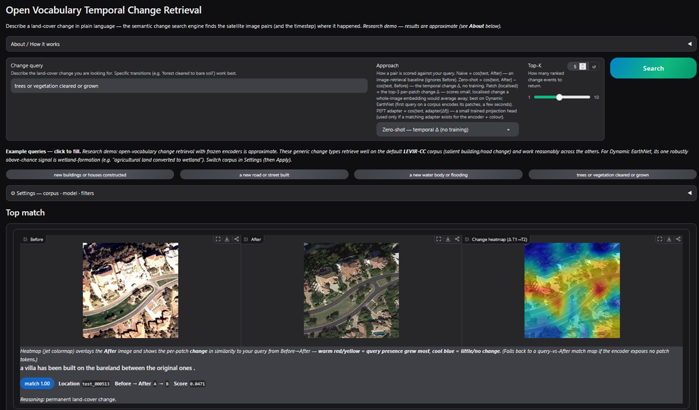

# Open Vocabulary Temporal Change Retrieval (GBDA Lab Project)

A *Semantic Change Search Engine*: given a natural-language query
(e.g. *"new buildings on former agricultural land"*, *"forest cleared to bare
soil"*), retrieve the satellite image **pairs and the timestep** where that
change occurred — across a multitemporal dataset, without training a
class-specific detector.

Frozen vision-language backbones (CLIP / GeoRSCLIP / RemoteCLIP) encode each
timestep; a bi-temporal *change feature* is matched against the query text.
Primary dataset: **Dynamic EarthNet (DEN)**; the abstraction is
dataset-agnostic (QFabric / fMoW slot in via the registry).

> **Just want to run the app?** See [`QUICKSTART.md`](QUICKSTART.md) —
> install, then a 30-second synthetic demo or the real dataset.

## Demo



*Enter a free-text change query, pick a dataset / encoder / scoring approach, and get
ranked before→after pairs with a change heatmap on T2.* To (re)generate the screenshot
locally (it lands in `assets/app_screenshot.png`):

```bash
pip install -e .
python -m scripts.make_den_fixture
python -m src.app --root tests/fixtures/den_tiny --split all --encoder clip_vitl14   # http://127.0.0.1:7860
# then save a screenshot of the browser tab to assets/app_screenshot.png
```

## Pipeline

End-to-end flow for one user query, with the module responsible at each
step:

```
┌─ offline (one-time per dataset+encoder, cached) ─────────────────────────┐
│                                                                          │
│  TemporalDataset.list_pairs()                src/datasets/*               │
│           │                                                               │
│           ▼                                                               │
│  load_pair_images(pair)  ──▶  PIL T1, T2                                  │
│           │                                                               │
│           ▼                                                               │
│  ImageTextEncoder.encode_image     src/encoders/*  (CLIP / GeoRS /        │
│           │                                          RemoteCLIP, frozen)  │
│           ▼                                                               │
│  f_T1, f_T2  (L2-normed, [N, D])  ──cache──▶                              │
│   data/cache/<dataset>__<encoder>__<split>[_<color>][_lora]__pair_embeddings.npz │
│                                       src/embeddings.py                   │
└──────────────────────────────────────────────────────────────────────────┘

┌─ adapter training (only for `peft` approach; offline) ───────────────────┐
│                                                                          │
│  weak caption per pair  ──ProjectionHead──▶  masked symm. InfoNCE         │
│  (e.g. "agriculture replaced by impervious surface")                     │
│                                              src/train.py                 │
│  → models/<dataset>__<encoder>__adapter.pt                                │
└──────────────────────────────────────────────────────────────────────────┘

┌─ inference (per query, hot path) ────────────────────────────────────────┐
│                                                                          │
│  user query text  ─encoder.encode_text─▶  t  (same shared [D] space)     │
│                                                                          │
│       ┌───────────────── ChangeRetriever.score_all ──────────────────┐    │
│       │   naive      :  t · f_T2                                     │    │
│       │   zero_shot  :  t · f_T2  −  t · f_T1   (Δ-similarity)       │    │
│       │   peft       :  t · g(Δf)   with Δf = f_T2 − f_T1            │    │
│       └────────────────────────────────────────────────────────────┘    │
│                              src/retrieval.py                            │
│                                    │                                     │
│                                    ▼                                     │
│  rank all pairs by score  ──▶  top-K change events                       │
│                                    │                                     │
│                                    ▼                                     │
│  for top-1: dataset.load_pair_images(pair)  +                            │
│  encoder.compute_patch_text_similarity → heatmap on T2                   │
│                                              src/app.py + src/heatmap.py │
│                                                                          │
│  label-grounded benchmark (offline, optional)                            │
│  per-query relevance from PairLabel → Recall@K, mAP, seasonal drift      │
│                                              src/benchmark.py            │
└──────────────────────────────────────────────────────────────────────────┘
```

Three scoring **approaches** (the supervisor-requested comparison):

| Approach    | Score                                       | Training |
|-------------|---------------------------------------------|----------|
| `naive`     | cos(t, f_T2)                                | none (lower bound) |
| `zero_shot` | cos(t, f_T2) − cos(t, f_T1)  (Δ-similarity) | none |
| `peft`      | cos(t, g(Δf)), g = trained ProjectionHead   | ~0.5–0.7 M params (adapter only; backbones frozen) |

*Per-encoder results for all three approaches — in-distribution and cross-split — are in [`REPORT.md`](REPORT.md) §7.*

**Key decoupling:** `f_T1, f_T2` are cached per `(dataset, encoder, split, color_mode)` so all
three approaches and any number of queries reuse the same one-time encode
pass. Adding a dataset = implementing the `TemporalDataset` protocol +
registering — the entire flow above re-uses the new dataset unchanged
(see [`docs/ARCHITECTURE.md`](docs/ARCHITECTURE.md)).

**Evaluation** is label-grounded: a fixed query set (per dataset, under
`src/queries/<name>.py`) maps each query to a relevance rule over the
derived `PairLabel`s → Recall@K, mAP, plus a seasonal-vs-permanent
("semantic drift") error report.

## Module map

| File | Role |
|------|------|
| `src/datasets/` | `TemporalDataset` protocol, `DENDataset` (raster), `DENNpyDataset` (DynNet `.npy` + `color_mode` rgb/nrg/ndvi via NIR infrared frames), `QFabricDataset` (`images_only` parquet), `TEOChatlasQFabricDataset` (`qfabric_teo` — QFabric crops + real change-type labels), layout-detecting registry + opts adapters |
| `src/queries/` | Per-dataset query sets (`den.py`, `qfabric.py`); registry resolved by `dataset.name` |
| `src/results_io.py` | serialize `BenchmarkReport` to JSON/CSV (torch-free); consumed by the figure scripts |
| `src/error_analysis.py` | per-query confusion matrix + precision/recall (seasonal-vs-permanent error analysis) |
| `src/encoders/` | `ImageTextEncoder` protocol; `clip_vitl14` (768-d), `georsclip` (512-d), `remoteclip` (768-d) |
| `src/text_encoder.py` | frozen CLIP text tower (`text_model` + `text_projection`, device-aware) |
| `src/features.py` | `compute_change_feature` (difference / concatenate) |
| `src/embeddings.py` | per-pair `f_T1,f_T2` compute + npz cache (`PairEmbeddingStore`); `cache_tag` arg keys cache by split+color to prevent cross-split collision |
| `src/retrieval.py` | `ChangeRetriever` — naive / zero_shot / peft scoring |
| `src/benchmark.py` | query set + label relevance, Recall@K / mAP / drift |
| `src/model.py` | `ProjectionHead` adapter, InfoNCE, adapter save/load |
| `src/train.py` | PEFT training (masked symmetric InfoNCE on weak captions) |
| `src/lora_train.py` | LoRA fine-tuning of visual encoder via peft; `train_lora`, `merge_lora_into_encoder`, `save_lora` |
| `src/geo_filter.py` | `GeoFilter` — filter pairs by continental region or lat/lon bbox using `aoi_metadata.json`; toggleable |
| `src/rerank.py` | `Reranker` — post-retrieval re-ranking: `diversity` (unique AOIs) or `coherence` (cluster near top-1); toggleable |
| `src/app.py` | Gradio engine + UI (Dataset / Encoder / Approach selectors) |
| `app.py` | HuggingFace Spaces entry point (uses tiny fixture by default; override via env vars) |
| `scripts/download_den.py` | fetch + extract DEN subset, build label index |
| `scripts/download_qfabric.py` | fetch a QFabric image subset from HuggingFace (images-only; qualitative demo) |
| `scripts/build_qfabric_labels.py` | TEOChatlas RQA2 → `qfabric_teo_labels.json` (27,879 real crop→change-type labels) |
| `scripts/benchmark_qfabric.py` | extract QFabric crops + encode + label-grounded change-type mAP (`qfabric_teo`) |
| `scripts/make_den_fixture.py` | tiny synthetic DEN tree for fast tests |
| `scripts/run_pipeline.py` | one-command run with `--train-split` / `--eval-splits` / `--color-mode` / `--mode` / `--lora` / `--results-dir`; cross-split mAP table |
| `scripts/export_results.py` | regenerate benchmarks from cache → `results/*.json` + `macro_summary.csv` (`--confusion` for error analysis) |
| `scripts/make_figures.py` | publication PNGs (recall curves, mAP bars, colour heatmap, seasonal drift, cross-split, confusion) from `results/` |
| `scripts/make_comparison_figure.py` | static zero-shot-vs-PEFT top-K visual comparison per encoder |
| `scripts/lora_sweep.py` | LoRA rank/epoch sweep (georsclip+nrg), in-memory, no cache/model clobber |

## Run / install / tests

All commands (setup, demo, real data, training, tests) in [`QUICKSTART.md`](QUICKSTART.md).

RS-encoder weights download from HuggingFace on first use into `.model_cache/`.
DEN dataset sources in [`docs/Common_Resources.md`](docs/Common_Resources.md).
On-disk layouts (`planet/*.tif` raster or DynNet preprocessed `.npy`) auto-detected.

## Extending

Adding a dataset is file-additive only — never edit shared pipeline files.
Full contract: [`docs/ARCHITECTURE.md`](docs/ARCHITECTURE.md).
